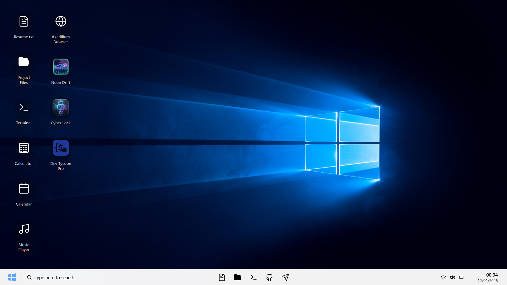
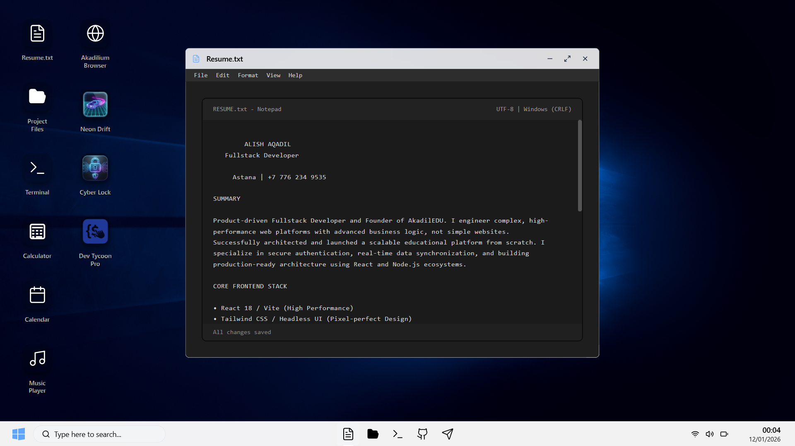
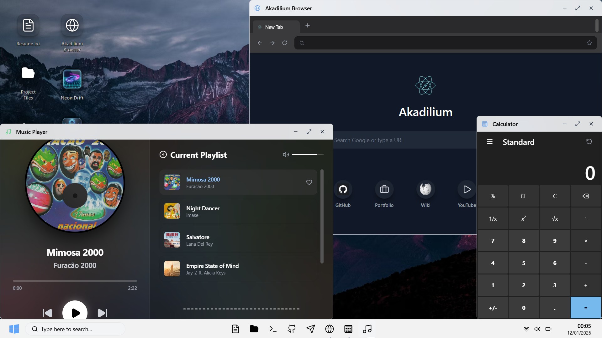
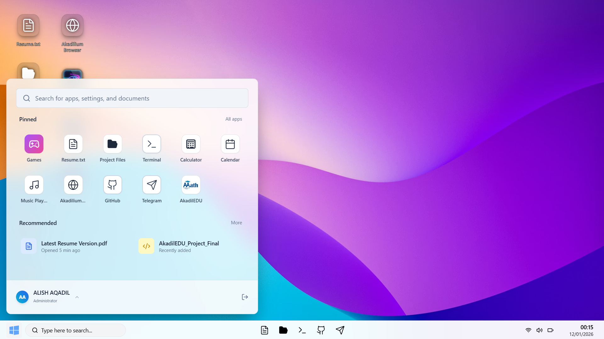

# AqadilOS
<table>
  <tr>
    <td width="50%"></td>
    <td width="50%"></td>
  </tr>
</table>

<table>
  <tr>
    <td width="50%"></td>
    <td width="50%"></td>
  </tr>
</table>

## Project Overview

AqadilOS is an interactive, web-based simulation of a modern Windows 10 / 11 style desktop environment. It is designed and implemented by **ALISH AQADIL** as a portfolio and demonstration project.

The goal of AqadilOS is to recreate the feeling of working inside a real operating system:

- Desktop with icons, taskbar and window frames
- Multiple "apps" running in movable, focusable windows
- A Notepad app that contains the creator's résumé and can export a styled PDF
- Additional utility and showcase apps (browser, terminal, media, games)

Everything runs entirely in the browser. There is no backend. The live deployment target for this project is:

- `https://aqadilos.web.app`

## CV / Portfolio Context!

AqadilOS is a personal CV / portfolio project for **ALISH AQADIL**. It is not a generic design system, boilerplate or product. The entire operating-system metaphor exists to present one thing:

- The résumé and experience of a full‑stack / front‑end engineer
- The ability to architect a non‑trivial single page application (SPA)
- Comfort with modern JavaScript, React, TypeScript‑ready patterns, JSX, Tailwind CSS and WebGL

Every window, app and animation in AqadilOS is part of this portfolio. The Notepad window is literally the résumé. The Explorer, Browser, games and utilities exist to show depth: state management, async flows, 3D rendering, layout work and interaction design in one cohesive experience.

## Concept and Design Intent

AqadilOS is not a generic UI kit. It is a single, coherent experience that mixes elements of Windows 10 and Windows 11:

- Rounded, glass-like window chrome and taskbar
- Modern iconography and motion
- Desktop wallpaper theming
- Start-style navigation through apps

The project is meant to show:

- Frontend architecture skills beyond a simple landing page
- Ability to organize a multi-window UI and shared OS-like state
- Integration of 2D UI, 3D scenes and custom export flows (PDF resume)

## Feature Highlights

- Desktop shell with boot screen, wallpaper and taskbar
- Window manager with focus, z-order and per-app sizing
- Resume-focused Notepad app with styled PDF export
- File Explorer style app showing project structure and metadata
- Sandbox browser with basic navigation and security gating
- Terminal-styled console window
- Music player and other atmospheric details
- 3D game-like experiences built with WebGL

## Applications Inside AqadilOS

AqadilOS ships several first-class "apps" that run inside window frames:

- **Notepad**  
  Central app for this portfolio. Contains the résumé text for ALISH AQADIL and can export it as a styled PDF. The export uses a custom HTML template, inline styles and `window.print` to keep all logic client-side.

- **Explorer**  
  A project-oriented file explorer. It visualizes the repository structure and project modules, and links into a dashboard-like view. It is not a real filesystem, but a curated map of how the codebase is organized.

- **Browser**  
  A tabbed, embedded browser surface. It can open external URLs under an iframe sandbox and detects sites that disallow embedding (for example with X-Frame-Options). For those, it offers to open the link externally via a security gate.

- **Terminal**  
  A styled terminal window used for visual atmosphere. It is not a full shell, but it simulates the feeling of a console integrated into the OS.

- **Music Player**  
  A simple player for local audio assets, built to complement the OS feeling with sound.

- **Games (NeonDrift, SystemOverride, DevTycoon)**  
  Three WebGL-based scenes using React Three Fiber and Drei. These are small 3D experiences used to demonstrate comfort with 3D rendering, post-processing and interaction inside the same OS shell.

Additional smaller or supporting components (e.g. Settings, Contact/Donate windows) are organized as separate apps but all plug into the same OS window system.

## Architecture and Technology

At a high level AqadilOS consists of:

- **React application shell**  
  `src/App.jsx` wires the OS context, window manager, boot screen, taskbar, desktop icons and window frames.

- **Window manager hook**  
  `src/hooks/useWindowManager.js` is responsible for opening, focusing and ordering windows. It tracks a list of open windows, their metadata (app id, size) and ensures that the active window is always on top.

- **OS context**  
  `src/components/os/OSContext.jsx` exposes OS-level state such as wallpaper, theme and global configuration. This allows different apps and shell components to coordinate on the same environment.

- **Security gate**  
  `src/components/SecurityGate.jsx` wraps potentially unsafe external content and centralizes logic for opening links in a controlled way.

- **Apps configuration registry**  
  `src/data/appsConfig.jsx` is the central map of all available apps: ids, titles, icons, default window sizes and the React component used to render each app. The taskbar, start menu and window manager use this registry to know what can be launched.

- **Static data**  
  `src/data/resumeText.js`, `src/data/projectStructure.js` and related files hold human-readable content that is rendered in apps such as Notepad and Explorer.

- **Styling**  
  The project uses Tailwind CSS utilities together with a small layer of custom CSS in `src/index.css` for OS-specific classes (window chrome, taskbar, desktop icons). 3D scenes use React Three Fiber and Drei abstractions over Three.js.

## Directory Structure

The high‑level layout of the repository is:

```text
aqadil-os/
├─ public/
│  ├─ index.html              # Base HTML shell
│  ├─ me.jpg                  # Profile photo used in resume PDF
│  ├─ akadilium.png, logo.png # Branding for apps and browser
│  ├─ audio/                  # Startup and ambient sounds
│  └─ misc icons, textures    # Static assets for desktop and games
├─ src/
│  ├─ App.jsx                 # Main OS shell component
│  ├─ App.css                 # App-level styles used by shell
│  ├─ main.jsx                # React + Vite entrypoint
│  ├─ index.css               # Global and OS-level styling helpers
│  ├─ assets/                 # Reserved for imported assets (if any)
│  ├─ components/
│  │  ├─ BootScreen.jsx       # Boot / startup experience
│  │  ├─ SecurityGate.jsx     # Wrapper for external / untrusted content
│  │  ├─ apps/                # All windowed applications
│  │  │  ├─ Notepad.jsx       # Resume editor + styled PDF export
│  │  │  ├─ Explorer.jsx      # Project file explorer + dashboard entry
│  │  │  ├─ Browser.jsx       # Tabbed sandbox browser UI
│  │  │  ├─ Terminal.jsx      # Console-style window
│  │  │  ├─ MusicPlayer.jsx   # Audio player
│  │  │  ├─ Calculator.jsx    # Calculator UI
│  │  │  ├─ Calendar.jsx      # Calendar and schedule mock
│  │  │  ├─ Dashboard.jsx     # Project dashboard overview
│  │  │  ├─ ContactApp.jsx    # Contact card / profile details
│  │  │  ├─ ContactWallet.jsx # Payment / contact wallet style view
│  │  │  ├─ DonateApp.jsx     # Support / donation information
│  │  │  ├─ SettingsApp.jsx   # Settings and personalization UI
│  │  │  ├─ ExternalLinkApp.jsx # Simple wrapper for external links
│  │  │  ├─ WindowsExplorer.jsx # Low-level file grid used by dashboard
│  │  │  ├─ GamesFolder.jsx   # Entry into 3D games
│  │  │  ├─ SecurityRules.jsx # Security rules / explanation surface
│  │  │  └─ games/            # 3D mini games
│  │  │     ├─ NeonDrift.jsx  # Racing-style scene (React Three Fiber)
│  │  │     ├─ DevTycoon.jsx  # Productivity / code swirl scene
│  │  │     └─ SystemOverride.jsx # Cyber lock puzzle scene
│  │  └─ os/                  # OS chrome and behavior
│  │     ├─ DesktopIcons.jsx  # Desktop icon grid
│  │     ├─ Taskbar.jsx       # Taskbar and app switcher
│  │     ├─ StartMenu.jsx     # Start-style app launcher
│  │     ├─ WindowFrame.jsx   # Window chrome, controls and layout
│  │     ├─ DraggableApp.jsx  # Pointer + drag behavior for windows
│  │     └─ OSContext.jsx     # OS-level React context
│  ├─ hooks/
│  │  └─ useWindowManager.js  # Core window state management hook
│  ├─ data/
│  │  ├─ appsConfig.jsx       # Registry of apps and their config
│  │  ├─ projectStructure.js  # Virtual file tree for Explorer
│  │  ├─ resumeText.js        # Plain-text résumé content
│  │  └─ resumeData.js        # Structured resume/project info
├─ package.json               # Tooling and dependencies
├─ vite.config.js             # Vite bundler configuration
├─ tailwind.config.js         # Tailwind CSS configuration
├─ postcss.config.js          # PostCSS / Tailwind pipeline
└─ eslint.config.js           # ESLint configuration
```

This structure is intentionally explicit: each JS / JSX file corresponds to a visible part of the OS (an app, shell control or data provider). There are no hidden generators or codegen steps.

## Technology Stack

AqadilOS is a single-page application built on a modern front-end stack:

- Languages and core runtime: modern JavaScript (ESNext), JSX, HTML5, CSS3
- Framework: React (function components, hooks, context)
- Bundler / dev server: Vite
- Styling: Tailwind CSS plus handcrafted OS-specific classes in plain CSS
- 3D / graphics: Three.js via React Three Fiber and the Drei helper library
- Animation: Framer Motion for transitions and micro-interactions
- Icons: Lucide React icon set and a small number of custom images
- Tooling: ESLint, PostCSS, Autoprefixer, Node.js and npm scripts

From an architectural point of view, AqadilOS uses:

- A component-based layout where each desktop app is an independent React component
- React Context for OS-wide state such as wallpaper and environment
- A dedicated hook (`useWindowManager`) for window state, focus and ordering
- Plain React state for local UI concerns inside each app
- `localStorage` for persisting résumé text between sessions

## Resume Notepad and PDF Export

The Notepad app is the core of this project from a portfolio perspective. It demonstrates:

- Managing editable résumé text inside a windowed app
- Persisting changes to `localStorage` so edits survive reloads
- Allowing the user to restore the original résumé at any time
- Generating a styled PDF from the same content directly in the browser

The PDF flow is implemented by constructing a dedicated HTML document in memory, injecting the current résumé content, applying print-focused CSS, opening a new window, and triggering the browser's print dialog. A profile photo is embedded from the `public` directory and styled alongside the text.

## Desktop and Window System

The window system is built on plain React state and a few focused abstractions:

- The window manager hook keeps an ordered list of windows with their ids and configuration.
- Bringing a window to front reorders this list so that rendering order matches z-index.
- The OS shell renders a `WindowFrame` for each active window, passing the correct app component into the frame.
- Apps themselves are mostly unaware that they run inside a simulated OS; they receive props and render their own UI.

This design keeps the system flexible while avoiding heavy external state management libraries.

## Project Status

AqadilOS is a live, evolving portfolio project. The current version focuses on:

- A stable desktop shell
- A polished résumé Notepad and export flow
- A convincing Explorer and Browser experience
- A small set of 3D scenes that are performant enough for the web

Future iterations may refine visuals, add more system settings and improve accessibility, but the core concept is complete.

## Keywords

This project is a résumé / portfolio artifact, but it is also a reference implementation for several modern front-end concepts. Relevant search terms include:

- Windows 10 clone, Windows 11 clone, web desktop, web OS, browser OS
- React desktop, React window manager, React operating system UI
- React Three Fiber, Drei, Three.js portfolio, WebGL UI
- Tailwind CSS SPA, React Vite single-page application
- Resume OS, CV OS, interactive résumé, developer portfolio

## Disclaimer Regarding Assets

This project is a work of parody and is intended for educational and demonstrative purposes only. It is a technical re-interpretation of modern Windows 10 / 11 style interfaces for the web.

All graphical assets, icons, sounds and any other trademarked materials that resemble or are inspired by Microsoft Windows are the property of Microsoft Corporation. AqadilOS does not claim any ownership of those concepts or designs. Any similarity is used for commentary and portfolio demonstration.

Custom icons, layouts and assets created specifically for AqadilOS are original work by ALISH AQADIL unless otherwise noted.

## License and Terms of Use

Copyright (c) 2026 **ALISH AQADIL**

The original source code and unique implementation details for this project are proprietary. While the live site at `aqadilos.web.app` is intended for learning and demonstration, please respect the following terms:

- Unauthorized use, reproduction, distribution or hosting of this project, in whole or in part, is prohibited.
- The project is not licensed for reuse in other products or portfolios, whether commercial or non-commercial..
- Cloning the full experience, copying the visual identity, or repackaging it under a different name is not permitted.

If you are interested in technical ideas from AqadilOS, treat it as a reference for patterns, not as a template to copy directly.

## A Note on Unauthorized Copies

If you encounter a site that closely replicates AqadilOS and is not hosted under:

- `aqadilos.web.app`

then it is not an official deployment. These unauthorized copies are often outdated, incomplete or broken and do not represent the quality or intent of the original work.

For the authentic version and latest updates, always refer to `aqadilos.web.app` or the official repository managed by ALISH AQADIL.

